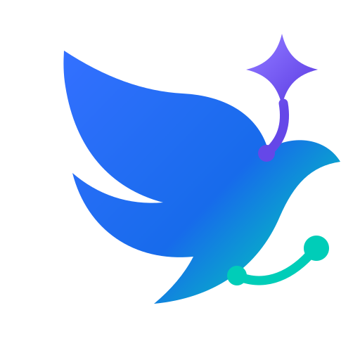

<p align="center">
  
</p>

<h1 align="center">lark-agent</h1>

`lark-agent` 是一个基于官方公开 Go SDK（official Go SDK）的个人 AI Agent。它在 macOS 本地运行，
通过 `github.com/larksuite/oapi-sdk-go/v3` 读取消息、消费 WebSocket 实时事件并
发送回复；它不执行 `lark-cli` 子进程，不解析 stdout/NDJSON，也不复制官方 CLI 的
内部代码。

## 文档怎么读

完整地图见 [docs/README.md](docs/README.md)。按任务选文件：

| 任务 | 文档 |
| --- | --- |
| 本机安装常驻助手 | [macOS 安装](docs/install-macos.md) |
| 改配置字段 | [配置说明](docs/configuration.md) |
| 查队列、审批、恢复、代码调查 | [运行、恢复与故障处理](docs/operations.md) |
| GitHub 工作流、评论唤醒、智能命令 | [智能命令与 GitHub](docs/smart-command.md) |
| 改代码、跑测试 | [开发与验证](docs/development.md) |

`spec/` 是现行行为契约。`changes/` 只说明某次为什么改，不是说明书。

## 能做什么

- 只有 Owner 可以私聊助手或在允许的群里直接 @机器人提问。非 Owner 私聊机器人或直接 @机器人时保持静默。
- 群里直接 @Owner、以及用户身份可见的真人私聊，才可能触发只读智能代回复；默认先等 `policy.owner_wait`（3 分钟），再按语义判断要不要答。
- 范围由 `assistant.reply_scope`、`policy.reply_scope`、`policy.private_reply_scope` 分别控制；默认 `all_groups` / `all_private`。
- 编程问题可在配置的 Workspace 内做有界读取和搜索；非 Owner 始终只读。
- GitHub Actions 可把可信工作流结果发到指定群，也可跑一条智能命令。默认仍是普通通知；`mode: run` 才读事件并调用具名写入工具。细节见 [智能命令与 GitHub](docs/smart-command.md)。
- 所有消息和外部动作写入 SQLite。无状态只读工作可以安全重算；对话调查和未发送回复候选保持中断；结果不确定的外部动作绝不重放。
- 对外语言优先使用 `owner.preferred_language`。Owner 可保存记忆；私人任务规则写在配置旁的 `TASK_RULES.md`。

## 要求

- macOS
- Go 1.25 或更新版本（从源码构建时）
- Lark 自建应用的 `app_id`，以及写入 macOS Keychain 的 app secret；用户 token 可选，
  只用于用户身份轮询和代回复
- 一个已配置的模型档案；模型密钥写入 macOS Keychain，不写入配置文件或日志

`lark-agent` 不维护第二个 `lark-cli` Fork，也没有 Linux/Windows 安装器或传输插件
接口。

## 快速开始

```bash
go build -o ./lark-agent ./cmd/lark-agent
./lark-agent init \
  --workspace /absolute/path/to/workspace \
  --app-id cli_xxx \
  --owner-open-id ou_xxx \
  --owner-name "姓名" \
  --preferred-language zh-CN
./lark-agent auth login < /path/to/private-lark-credentials.json
./lark-agent doctor --lark-only
```

需要模型时，先配置模型档案并把密钥写入 Keychain。默认档案是 Kimi `k3-256k`：

```bash
lark-agent model profile list
lark-agent model profile set primary \
  --provider kimi \
  --protocol openai_chat \
  --base-url https://api.kimi.com/coding/v1 \
  --model k3-256k
lark-agent model auth login primary < /path/to/private-model-key.json
lark-agent model doctor primary
```

安装当前用户的 macOS LaunchAgent 和状态栏：

```bash
./scripts/macos/install-lark-agent.sh
```

安装器按顺序执行完整 SDK/Keychain doctor、编译状态栏，最后才加载
`com.liuchong.lark-agent`。新进程没有进入 ready 状态时会立即卸载。步骤、参数和
回复范围示例见 [macOS 安装](docs/install-macos.md)。

`CHAT_QUERY` 只用于发现和标记配置群与验收群。默认
`assistant.reply_scope: all_groups`、`policy.reply_scope: all_groups` 和
`policy.private_reply_scope: all_private` 时，它不会限制其他群。真实 live
验收仍只在本次明确授权的群和机器人私聊中发送测试消息。

推荐把本机安装实例里不含秘密的配置备份到仓库 `/.local/owner-config/`；该目录已被
gitignore。运行中的配置仍以 `~/.config/lark-agent/` 为准，token 和密钥不要放进这个备份。

## 常用操作

```bash
lark-agent daemon status
lark-agent mode paused
lark-agent mode auto
lark-agent queue summary
lark-agent queue tasks --view action
lark-agent queue inspect --message-id om_xxx
lark-agent queue resume --message-id om_xxx
lark-agent queue acknowledge --work-id 123 --reason "reviewed and closed"
lark-agent queue reconcile --work-id 456 --result unknown --reason "external result could not be verified"
lark-agent memory list
lark-agent memory add preference "优先使用中文回复"
lark-agent rules check
lark-agent rules init
lark-agent github auth status
lark-agent run --help
lark-agent github run --help
lark-agent github notify --help
```

Owner 还可以在智能助手私聊中发送 `/help`、`/status`、`/tasks`、`/memory`、`/rules`。
群里的控制命令只会提示转到私聊。完整命令、恢复和审批见
[运行、恢复与故障处理](docs/operations.md)。

## GitHub

- 只要把 CI 结果发到飞书：用 `github notify`。本仓库 `.github/workflows/lark-notify.yml` 不用加 `mode`。
- 要根据评论、PR、Issue、push 或 release 做一次有模型的判断：用 `github run`。
- 评论唤醒词是 `@lark-agent`。斜杠命令只有 `/review`、`/title`、`/check`。

本地常驻助手的 GitHub 读取令牌单独放在 macOS Keychain：

```bash
lark-agent github auth login < /path/to/private-github-token.json
lark-agent github auth status
```

登录 JSON 只有 `token` 字段。该令牌只用于读取已验证引用，不提供评论、合并或其他写能力。
工作流、Environment、允许写入的工具和本仓库已启用的示范，全部写在
[智能命令与 GitHub](docs/smart-command.md)。

## 云文档与 Base

`lark-agent subscription add URL` 登记 Wiki、文档或 Base，随后运行
`lark-agent subscription sync`。Agent 会接收云文档应用通知、评论 `@Owner` 和 Base
记录变更，但不会把通知正文当成指令。操作步骤见
[运行、恢复与故障处理](docs/operations.md)。
